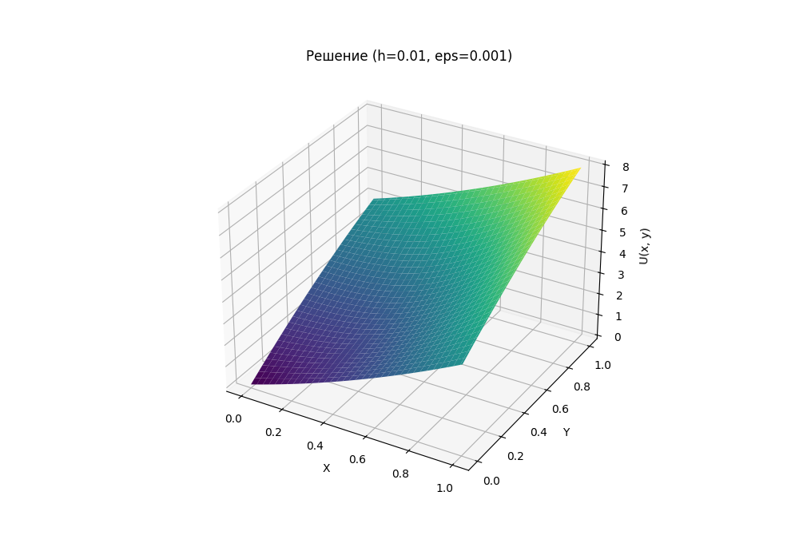

# Отчет: Лабораторная работа 1 (Вариант 12)

Решение задачи Дирихле для уравнения Лапласа методом конечных разностей.

## 1. Реализация на Python (Циклы, Метод Гаусса-Зейделя)

| h | eps = 0.1 | eps = 0.01 | eps = 0.001 |
|---|---|---|---|
| 0.1 | 0.0014c (21 итер.) | 0.0030c (44 итер.) | 0.0042c (67 итер.) |
| 0.01 | 0.2254c (32 итер.) | 1.8270c (263 итер.) | 13.8282c (1899 итер.) |
| 0.005 | 0.9731c (33 итер.) | 8.2563c (281 итер.) | 70.3400c (2433 итер.) |

## 2. Реализация на NumPy (Векторизация, Метод Гаусса-Зейделя)

| h | eps = 0.1 | eps = 0.01 | eps = 0.001 |
|---|---|---|---|
| 0.1 | 0.0011c (21 итер.) | 0.0021c (44 итер.) | 0.0034c (67 итер.) |
| 0.01 | 0.1602c (32 итер.) | 1.3994c (263 итер.) | 9.7103c (1899 итер.) |
| 0.005 | 0.6934c (33 итер.) | 5.7452c (281 итер.) | 51.8721c (2433 итер.) |

## 3. Графики решений (NumPy)

Графики построены для `eps = 0.001`.

### Решение для h = 0.1

### Решение для h = 0.01

### Решение для h = 0.005

