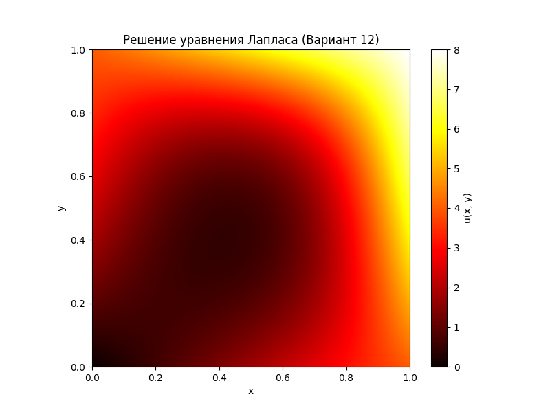

# Отчет по Лабораторной работе 2
## Решение задачи Дирихле для уравнения Лапласа

### 1. Постановка задачи (Вариант 12)

Требуется решить уравнение $\Delta u = 0$ на сетке.

**Граничные условия:**
* $u(0, y) = 5y - y^2$
* $u(1, y) = 4 - y^2 + 5y$
* $u(x, 0) = x^2 + 3x$
* $u(x, 1) = x^2 + 3x + 4$

---

### 2. Результаты замеров времени

Ниже приведены результаты экспериментов для двух реализаций.

#### Таблица 1. Реализация на Python (Numba)

| Шаг $h$ | $N$ | $\varepsilon$ | Время (сек) |
| :---: | :---: | :---: | :---: |
| 0.1 | 10 | 0.1 | 0.000000 |
| 0.1 | 10 | 0.01 | 0.000000 |
| 0.1 | 10 | 0.001 | 0.000000 |
| 0.01 | 100 | 0.1 | 0.000000 |
| 0.01 | 100 | 0.01 | 0.003100 |
| 0.01 | 100 | 0.001 | 0.026537 |
| 0.005 | 200 | 0.1 | 0.002001 |
| 0.005 | 200 | 0.01 | 0.016545 |
| 0.005 | 200 | 0.001 | 0.141851 |

#### Таблица 2. Реализация на C++ (PyBind11)

| Шаг $h$ | $N$ | $\varepsilon$ | Время (сек) |
| :---: | :---: | :---: | :---: |
| 0.1 | 10 | 0.1 | 0.000000 |
| 0.1 | 10 | 0.01 | 0.000000 |
| 0.1 | 10 | 0.001 | 0.000000 |
| 0.01 | 100 | 0.1 | 0.001000 |
| 0.01 | 100 | 0.01 | 0.006096 |
| 0.01 | 100 | 0.001 | 0.034032 |
| 0.005 | 200 | 0.1 | 0.002507 |
| 0.005 | 200 | 0.01 | 0.021046 |
| 0.005 | 200 | 0.001 | 0.183287 |

---

### 3. Визуализация решения

Для параметров $h=0.005$ и $\varepsilon=0.001$:

